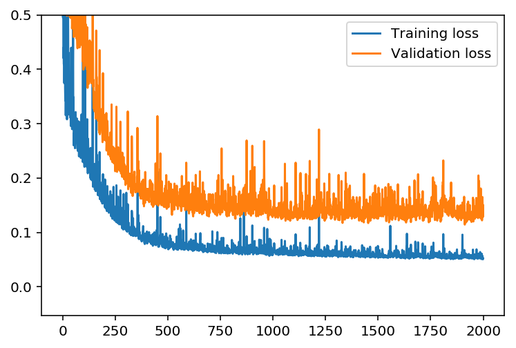
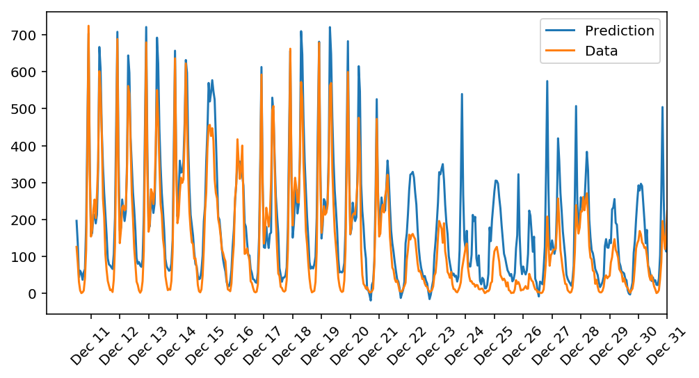

# deeplearning-experiments-bikesharing
A deep learning experiment to predict the number of bikeshare users on a given day.
I'm using a simple two-layer neural network (hand-coded for practice). The hyperparameters have been
choosen through a bit of trial and error.

The goal is to predict the number of shares a few days ahead of time, so the shop can make sure to have
the right number of bikes and staff ready to handle the load.

## Result
Here's what the training progress looks like for the following hyperparameters:

- 2000 epochs
- learningrate 0.1
- 30 hidden nodes

For the hyperparameters above, the training loss is 0.052, and the validation loss is 0.149

And the prediction performance looks as follows:

The model predicts the data quite well during the normal period of the year, but it fails to predict accurately duing the Christmas/New Year holiday period. Reason it fails is that that period is unusually slow, and the model is not sophisticated enough to learn that. Also, the dataset only had one such period in it, so there wasn't much opportunity for the model to learn.

Looking at the input data, I can see that the "holiday" column only marks whether a specific day was an official holiday (like Christmas), but it doesn't indicate whether it's a holiday period. I haven't tried, but I suspect that changing the input data so that the holiday column is set to one for slow periods, rather than an official holiday would help the model to predict better during that time.

## Possible improvements
1. Don't use a constant learning rate. Start from e.g. 0.1 and gradually decrease the learning rate for every epoch, or step to a lower learning rate every 200 epochs etc. This will make the model converge more gradually towards the end, instead of constantly overshooting the local minima.

2. The dataset only has one Christmas period in it, and as a result, the model is not very accurate for this period. More data would help to improve the model.

3. Use the hourly data to predict expected load for the rest of the day, so shop owner can e.g. send some of the staff home in the afternoon.

